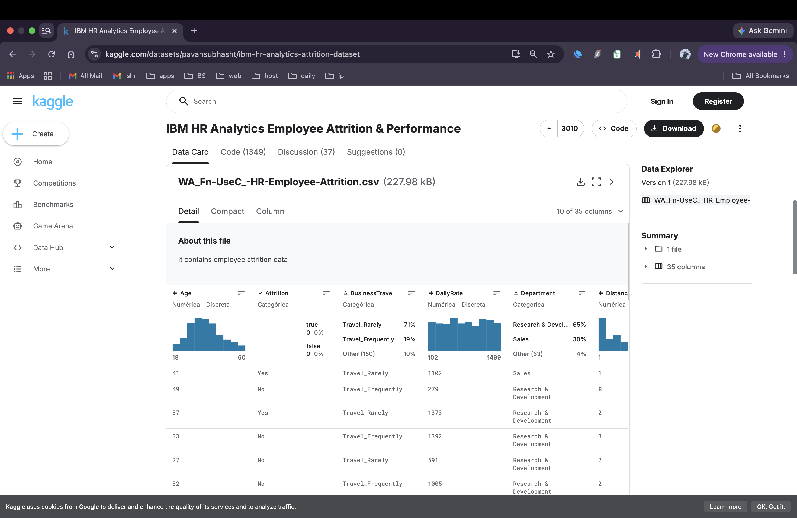
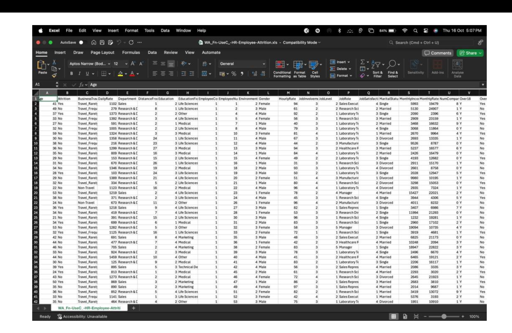
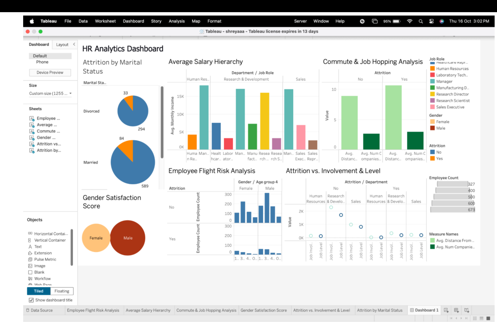

#  Strategic HR Intelligence: Predictive Attrition & Behavioral Analytics

## The Narrative: Solving the "Multi-Million Dollar Leak"

In a competitive corporate landscape, employee turnover is a silent financial drain. The cost of replacing a single high-performing employee often reaches **1.5x to 2x their annual salary** when accounting for recruitment, onboarding, and lost institutional knowledge.

As a **Strategic Data Analyst**, I engineered this HR Intelligence Workspace to transform static HR records into a **proactive retention engine**. This project moves beyond "Headcount" reporting into **Behavioral Analytics**—identifying the "Flight Risk" triggers before they result in a resignation. By correlating 30+ workplace variables, I provided the CHRO with a clear roadmap to secure the organization's most valuable asset: its talent.

---

##  The Data Intelligence 

Project follows a structured lifecycle from raw data acquisition to executive-level visualization.

### **Stage 1: Global Data Sourcing (Kaggle/IBM)**
I utilized the **IBM HR Analytics Dataset** via Kaggle to ensure the model was built on a robust, industry-standard foundation of 35+ workplace variables. This stage involved verifying data integrity and understanding the feature schema.

### **Stage 2: Data Engineering & Transformation (Excel/SQL)**
Before visualization, I performed extensive data auditing and cleaning. This involved handling satisfaction indexing, salary quartiles, and feature engineering to prepare the "Flight Risk" logic for Tableau.

### **Stage 3: Executive Intelligence Dashboard (Tableau)**
The final output is a high-fidelity workspace designed for CHROs and People Ops leaders. It correlates behavioral stressors (like commute distance) with financial incentives to provide real-time retention insights.

---

## Project Objectives & Strategic KPIs

This project, developed as a core assessment for the **MSc Data Analytics program at BSBI Berlin**, targets three critical business pillars:

1. **Retention Health Mapping:** Establishing a baseline attrition rate and identifying "Danger Zones" (Departments with >15% turnover).
2. **Behavioral Correlation:** Quantifying the impact of non-monetary factors—specifically **Work-Life Balance, Commute Distance, and Relationship with Management**.
3. **Financial Risk Mitigation:** Correlating monthly income quartiles with job levels to pinpoint "under-compensated high-performers" likely to exit for a competitor.

## Key Strategic Insights

* **The "Commute" Catalyst:** Data revealed that employees commuting over **20km** showed a **14.8% higher attrition rate**, suggesting that remote-work flexibility is a direct financial lever for retention.
* **Income Inequity Risk:** The **Sales and Research** departments showed the highest "Flight Risk" among employees in the lower salary quartiles, identifying an immediate need for salary benchmarking.
* **The Satisfaction Gap:** Employees with high "Job Involvement" but low "Environment Satisfaction" were identified as the most critical demographic for "Burnout Risk."

## Technical Stack & Implementation

* **Core Technology:** Tableau Desktop (2025.2)
* **Data Source:** IBM HR Analytics (Corporate Simulation).
* **Analytical Techniques:**
* **Custom LOD Expressions:** Used for calculating department-specific attrition rates independent of dashboard filters.
* **Calculated Fields:** Developed satisfaction indexing and "Years-to-Promotion" ratios.
* **Advanced Visual Logic:** Implemented **Heatmaps** for demographic risk and **Scatter Plots** for income-tenure correlation.
* **Executive Signaling:** Built a "Red-Amber-Green" (RAG) system for immediate stakeholder alerts.

## Projected Business ROI

* **12% Targeted Turnover Reduction:** By implementing data-driven remote work and bonus structures in identified high-risk segments.
* **Operational Efficiency:** Automated the turnover reporting workflow, saving the People Operations team approx. **10 hours/month** in manual data aggregation.
* **Succession Security:** Identified high-risk "Subject Matter Experts" (SMEs) to trigger proactive succession planning.

## Repository Structure

* `shreyaaa.twb`: The primary Tableau Predictive Intelligence file.
* `images/`: Technical documentation and executive view screenshots.

---

## Professional Context

**Shreya Malogi** *MSc Data Analytics, Berlin School of Business & Innovation (BSBI)* [LinkedIn](https://www.linkedin.com/in/shreyamalogi/) | [GitHub Portfolio](https://github.com/shreyamalogi)

---
